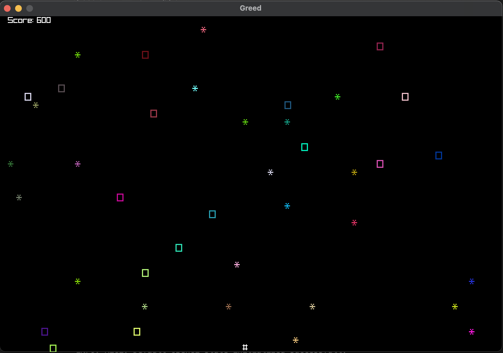

# Overview
---
Greed is a game in which the player seeks to gather as many falling gems as possible. The game continues as long as the player wants more!

[All of the documentation and images are taken from here](https://byui-cse.github.io/cse210-course-competency/inheritance/materials/greed-specification.html)

---
## Rules
---
Greed is played according to the following rules:

* Gems (*) and rocks (o) randomly appear and fall from the top of the screen
* The player (#) can move left or right along the bottom of the screen
* If the player touches a gem they earn a point
* If the player touches a rock they lose a point
* Gems and rocks are removed when the player touches them
* The game continues until the player closes the window

---
## Interface

---


---
## Getting Started

---
Make sure you have Python 3.8.0 or newer and Raylib Python CFFI 3.7 installed and running on your machine. You can install Raylib Python CFFI by opening a terminal and running the following command.
```
python3 -m pip install raylib
```
After you've installed the required libraries, open a terminal and browse to the project's root folder. Start the program by running the following command.```

python3 __main__.py
```
You can also run the program from an IDE like Visual Studio Code. Start your IDE and open the 
project folder. Select the main module inside the hunter folder and click the "run" icon.

---
## Project Structure

---
root                  (project root folder)
+-- data              (data files for game)
+-- game              (specific game classes)
+-- __main__.py       (entry point for program)
+-- README.md         (general info)

---
## Required Technologies

---
* Python 3.8.0
* Raylib Python CFFI 3.7

---
## Authors

---
* Antonio Saucedo (antoniojesus@byui.edu)
* Godwin Iyip (iyi21001@byui.edu)
* Manuel Cipriano (cip21002@byui.edu)
* Shane Cook (scc0131@byui.edu)
* (Cole) Ukeje Chinemerem (uke21001@byui.edu)

---
*Shane Cook is the author of this document*